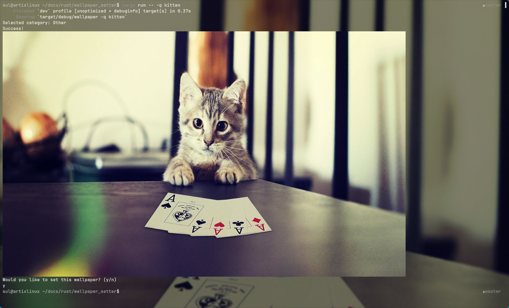

# Wallpaper Setter
A CLI tool that allows you to set a wallpaper for hyprland using api (wallhaven.cc).
- wallpapers are saved to $home_dir/pics/wallpapers (can be changed to your liking).
- An API key from wallhaven is needed for nsfw wallpapers. (must be in a .env file before compiling)

## Options:
- -w, --wal-type <WAL_TYPE>  wallpaper type to set (anime, other) [default: other]
- -q, --query <QUERY>        wallpaper query to search [default: ]
- -p, --pywal                pywal after wallpaper is set
- -h, --help                 Print help

## Screenshots

